<p align="center">
  
</p>

<h1 align="center">USAFCACARS</h1>

<p align="center">
  <strong>The official desktop flight operations, ACARS, communications, and simulation command center for USA Flight Club.</strong>
</p>

<p align="center">
  Flight planning · SimConnect telemetry · Live tracking · Weather · ATC · Voice communications · Aircraft systems · Passenger operations
</p>

<p align="center">
  
  
  
  
  
</p>

<p align="center">
  <a href="../../releases/latest">
    
  </a>
  &nbsp;
  <a href="https://usaflightclub.net/downloads">
    
  </a>
  &nbsp;
  <a href="https://usaflightclub.net">
    
  </a>
  &nbsp;
  <a href="https://usaflightclub.net/usafcacars/live">
    
  </a>
</p>

---

<p align="center">
  <a href="#major-systems"></a>
  <a href="#atc-and-airspace-operations"></a>
  <a href="#communications"></a>
  <a href="#aircraft-and-cabin-systems"></a>
  <a href="#research-media-and-workspaces"></a>
</p>
<p align="center">
  <a href="#pilot-community-and-support"></a>
  <a href="#simulator-and-server-integration"></a>
  <a href="#installation"></a>
  <a href="#troubleshooting"></a>
  <a href="#concept-image-index"></a>
</p>

> [!NOTE]
> GitHub Markdown does not support interactive content tabs. These tab-style links provide direct navigation while keeping every section visible and searchable.

---
> [!IMPORTANT]
> **USAFCACARS is currently in active alpha development.**
>
> Images labeled **Current** show the implemented application at the documented release. Images labeled **Concept**, **Design Reference**, or **Visual** show intended scope and design direction and should not be interpreted as confirmation that every displayed control or service is already implemented.
>
> Features, layouts, wording, data sources, integrations, and availability may change as development continues. The release notes for each downloadable build are the authoritative record of what is currently functional.

### Current development checkpoint — August 27, 2026

The development branches now include source-aware flight strips and a compact color legend; tour name/leg identification; corrected bid-active lifecycle handling; private Free Flight planning with APPEND TO BIDS; compact planner tabs; a full-area Map & Tools overlay that closes back to Timing; Scheduled navigation into the complete Search Flights workspace; clearer All PIREPs, Charters, and Tours filters; and an optional post-login Microsoft Flight Simulator 2024 launcher. These items are documented as development work only. No new installer or deployed application update was published with this checkpoint.

> [!CAUTION]
> Alpha builds may contain incomplete features, visual placeholders, disabled controls, configuration changes, or defects. Do not rely on an alpha build as the only method of recording an important flight.

---

## The USAFCACARS Vision

USAFCACARS is being developed as a complete desktop operations environment for USA Flight Club pilots, dispatchers, controllers, and virtual aviation enthusiasts.

The project is intended to connect:

- A pilot’s USA Flight Club account
- The USAFC phpVMS platform
- Microsoft Flight Simulator
- SimConnect aircraft telemetry and controls
- Flight planning and briefing resources
- Live aircraft tracking
- Airport weather and charts
- Voice and radio communications
- Flightboard and ATC operations
- Aircraft systems management
- Passenger and cabin-service simulation
- Multi-window and multi-monitor workspaces

The goal is not to create only a small ACARS recorder. The long-term vision is a unified virtual airline operations center that remains useful before departure, throughout the flight, after arrival, and during ATC or community activity.

<p align="center">
  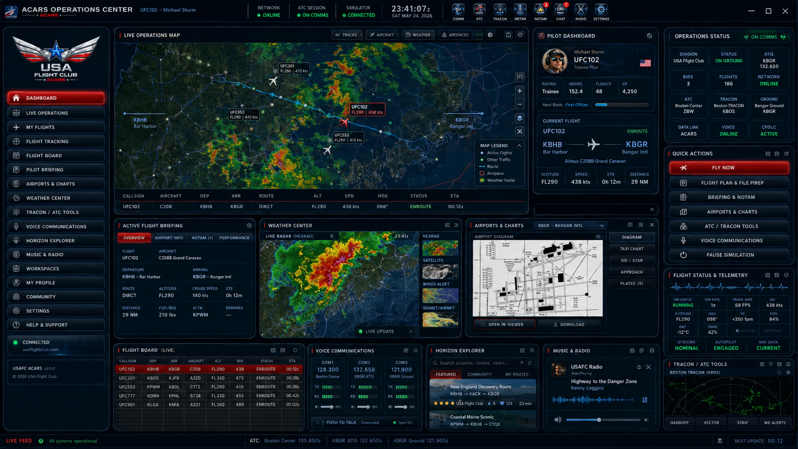
</p>

<p align="center">
  <em>Concept visualization of the complete USAFCACARS operations-center experience.</em>
</p>

---

## Application Overview

<p align="center">
  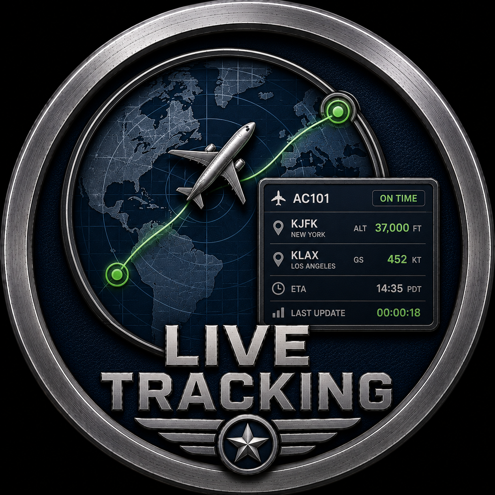
</p>

USAFCACARS is designed around a persistent operations shell with:

- Left-side feature navigation
- Pilot and account information
- Current-flight status
- Simulator and server connection indicators
- Quick operational actions
- Expandable feature panels
- Pop-out windows
- Workspace layouts
- Live telemetry
- Zulu time
- ATC and communications status
- A continuous operations feed

Selected modules can expand into the large center workspace between the permanent left and right rails. This allows a live map, flightboard, TRACON scope, briefing package, aircraft panel, or another major tool to use the full working area without losing access to the pilot and flight controls.
The pilot's expanded/collapsed choice follows them between center pages and is saved for later sessions. On a fresh launch only the initial Dashboard view is deliberately collapsed; after navigating, Dashboard and every other center page use the remembered state until the pilot changes it.

### Current Shell Rail Design

The lower-left status stack remains fixed while only the feature-link list scrolls. The right operations rail is responsive and reserves a stable scrollbar gutter, but only displays the scrollbar when the available monitor height actually requires it. Live pilot, flight, simulator, communications, airport, and weather data populate without resizing the surrounding frames.

<table>
  <tr>
    <td width="34%" align="center" valign="top">
      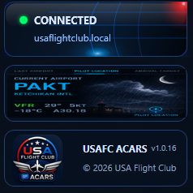
      <br>
      <strong>Left Navigation Status Stack</strong>
    </td>
    <td width="66%" align="center" valign="top">
      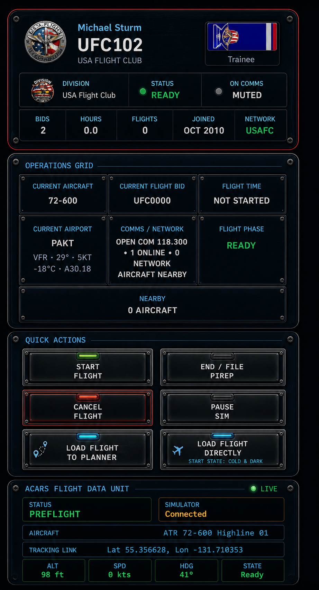
      <br>
      <strong>Right Operations Rail Design</strong>
    </td>
  </tr>
</table>

<table>
  <tr>
    <td width="50%" align="center">
      
      <br>
      <strong>Dashboard</strong>
    </td>
    <td width="50%" align="center">
      
      <br>
      <strong>Workspace Manager</strong>
    </td>
  </tr>
</table>

---

## Current Development Status

USAFCACARS remains an alpha project. Individual systems may be at different stages in any given build:

| Area | Development direction |
|---|---|
| Desktop shell and dashboard | Operational alpha; live route, aircraft, weather, radar, operations, and quick-action data |
| USAFC account and API integration | Active development |
| SimConnect telemetry | Active development |
| Flight tracking and PIREP workflow | Operational alpha with completed-bid cleanup and owner/completion PIREP safeguards |
| Live map and flightboard | Active development and expansion |
| Weather, airport data, and charts | Operational Weather Center alpha; airport/chart expansion continues |
| Voice communications | Operational alpha and active expansion |
| Horizon Explorer | Operational multi-tab alpha with bookmarks, imports, pop-outs, search, and aviation start page |
| Workspace Manager | Operational alpha with real layouts, named profiles, window placement, restore controls, and safe reset |
| ATC, TRACON, strips, and taxi management | Advanced concept and staged development |
| Aircraft systems control | Operational experimental panel; aircraft-specific depth remains active development |
| Passenger operations | Planned advanced simulation feature |
| Community and support centers | Searchable Help/diagnostics and Release Center implemented; Community expansion staged |

This table describes the project direction only. Consult the release notes for the exact capabilities of a particular build.
<details open>
<summary><strong>Current operational alpha</strong></summary>

Dashboard and flight tracking, the unified Scheduled/SimBrief/Free Flight/Charter/Tours planner, MSFS 2024 SimConnect and private EFB bridge integration, aircraft catalog/artwork cache, Communications Station, Weather Operations Center, Horizon Explorer, Workspace Manager, Release Center, and searchable Help & Support are implemented in the active development tree.

</details>

<details>
<summary><strong>Server and phpVMS integration</strong></summary>

The private USAFCACARS module supplies authentication, settings, flight/search/bid data, SimBrief capability, gates, weather, real-world traffic providers, communications, affiliate-network behavior, Tours, Charter integration, and PIREP lifecycle services. Private module and MSFS add-on source is never published in this public repository.

</details>

<details>
<summary><strong>Planned concepts preserved in this README</strong></summary>

ATC/TRACON control, expanded airport/taxi operations, passenger operations, deeper aircraft-specific cockpit control, broader Community functions, and other clearly labeled concept images remain roadmap material. Their artwork is intentionally preserved without representing those systems as finished.

</details>

---

# Major Systems

## Pilot Dashboard

The pilot dashboard provides an immediate, instrument-panel overview of the logged-in pilot, current USAFC session, active route, simulator, network, nearby traffic, aircraft, and operational status.

Current dashboard information includes:

- Pilot avatar
- Pilot name and ID
- Callsign
- Division or airline
- Rank and progression
- Network status
- Current airport
- Current flight
- Active aircraft
- Flight phase
- Bid count
- Hours and completed flights
- Voice communications state
- Simulator connection
- Quick flight actions
- Current weather

The dashboard is also the launch point for the other major USAFCACARS workspaces. Its route monitor uses a locked high-detail satellite view, progressively updates the live aircraft position during flight, exposes airport/procedure details, and keeps the collapsed and expanded workspace layouts proportional.

<p align="center">
  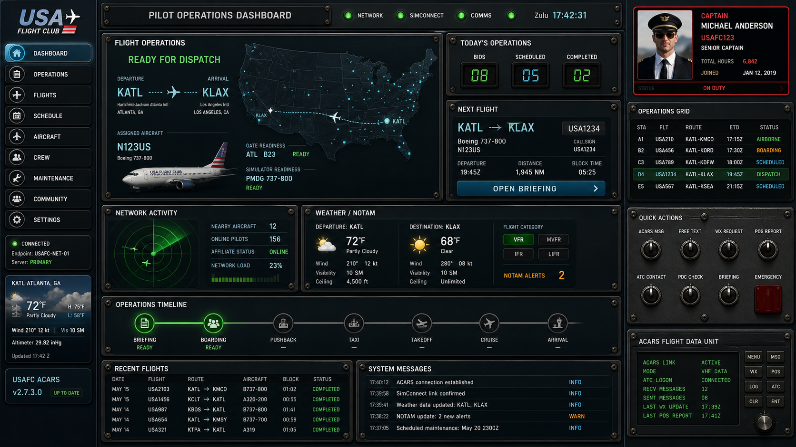
  <br>
  <em>Design reference retained for the implemented dashboard direction.</em>
</p>

---

## Flight Selection, Bids, and Flight Tracking

USAFCACARS is intended to integrate directly with the USA Flight Club flight and bid system.

Planned and developing capabilities include:

- Pilot login through USAFC services
- Current bid retrieval
- Available flights
- My Flights
- Completed flights
- Flight search
- Flight selection
- Aircraft assignment
- Route and airport briefing
- Flight start
- Live telemetry transmission
- Flight phase tracking
- Flight cancellation
- Flight completion
- Landing-rate capture
- PIREP submission
- Post-flight summary

Airport handling is intended to support both four-character identifiers and valid shorter identifiers such as `81R`.

---

## Live Operations Map

<p align="center">
  <a href="https://usaflightclub.net/usafcacars/live">
    
  </a>
</p>

The live USAFCACARS operations map is available at **[usaflightclub.net/usafcacars/live](https://usaflightclub.net/usafcacars/live)**.

The live map is designed to become a major center workspace that can expand across the full area between the permanent menus.

Target capabilities include:

- USAFC active aircraft
- Departure and arrival airports
- Planned routes
- Traveled trails
- Smooth aircraft movement
- Pilot and aircraft selection
- Pilot and flight information
- Weather overlays
- Radar
- Airspace
- Navigation layers
- Airports and runways
- Navaids
- Obstacles
- SID and STAR overlays
- ATS routes
- VATSIM traffic
- IVAO traffic
- ADS-B traffic
- ATC coverage
- Range and compass tools
- Zulu clock
- Saved layer profiles
- Pop-out map windows
- Independent map instances

<p align="center">
  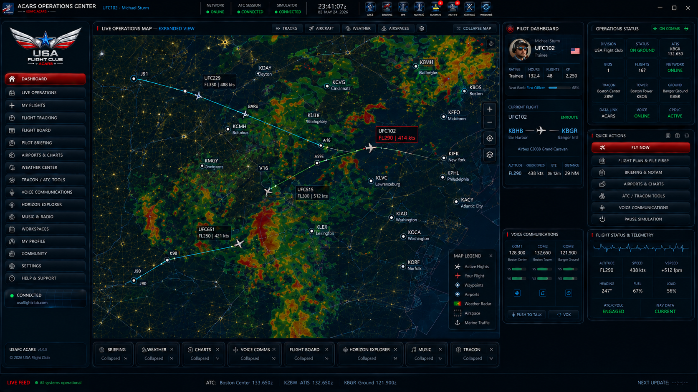
</p>

<p align="center">
  <em>Concept: the Live Operations Map expanded into the primary center workspace.</em>
</p>

<p align="center">
  
</p>

---

## Flightboard

The flightboard is planned as a live airport-style split-flap operations display.

Primary views:

```text
CURRENT
DEPARTURES
ARRIVALS
```

Possible traffic sources:

```text
USAFC
ADS-B
VATSIM
IVAO
```

Planned columns include:

| Phase | Status | Flight | Departure | Arrival | Departure Time |
|---|---|---|---|---|---|
| Estimated Arrival | Altitude | Speed | Heading | Type/Registration | Pilot |

Changed characters are intended to animate independently, reproducing a mechanical split-flap display without repeatedly flashing unchanged rows.

<p align="center">
  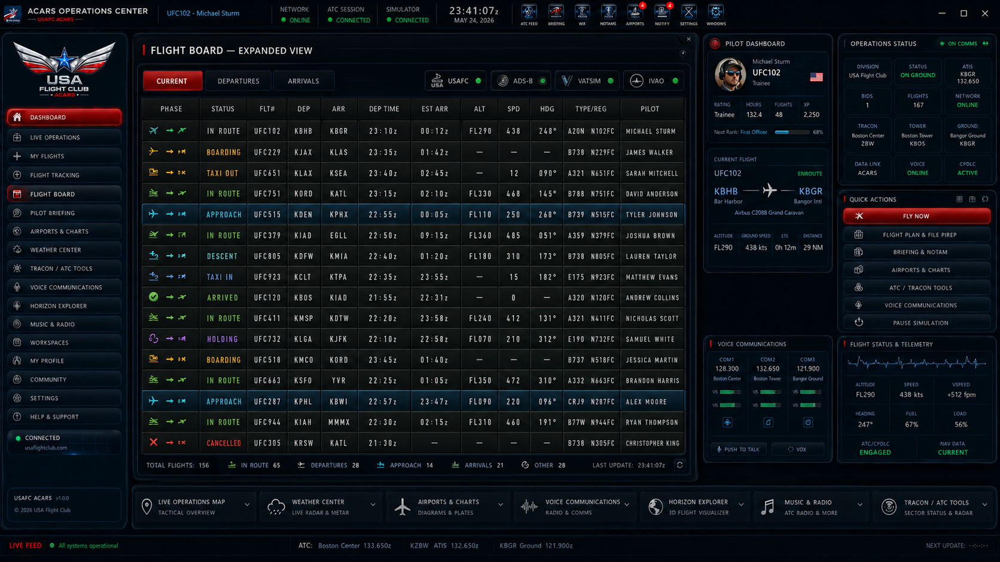
</p>

<p align="center">
  <em>Concept: Flightboard expanded between the permanent navigation and operations rails.</em>
</p>

<p align="center">
  
</p>

---

## Pilot Briefing

The unified Flight Planner and Pilot Briefing gathers operational information for Scheduled, SimBrief, Free Flight, Charter, and Tours flights into one instrument-style workspace.

Implemented core sections include:

- Flight summary
- Route overview
- Departure, arrival, and alternate airports
- Weather summary
- METAR and TAF
- Radar and satellite imagery
- Fuel planning
- Weight summary
- Aircraft performance
- Charts and procedures
- NOTAMs
- ATC and communications information
- Checklists
- Active warnings
- Departure and arrival runway information

<p align="center">
  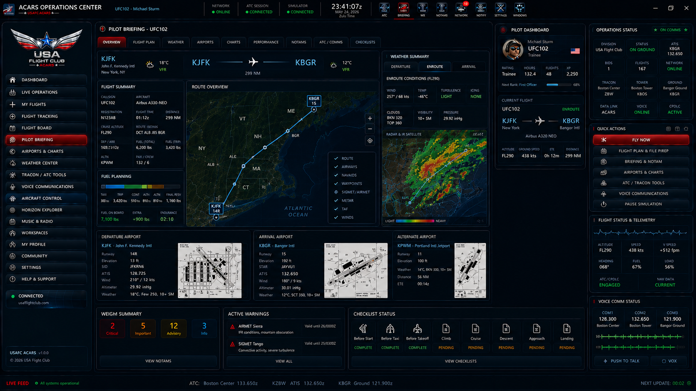
</p>

<p align="center">
  <em>Concept artwork remains preserved while the unified operational planner continues integration testing.</em>
</p>

<p align="center">
  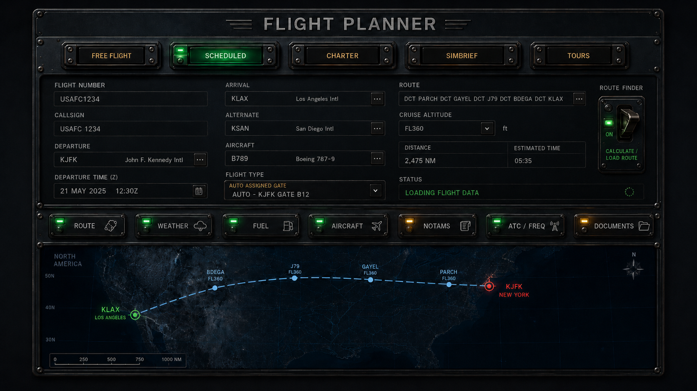
  <br>
  <em>Design reference for the unified flight-planning instrument; exact controls vary as integrations mature.</em>
</p>

---

## Airport Information and Charts

USAFCACARS is intended to provide airport information without forcing the pilot to leave the application.

Current dashboard information includes:

- Airport name and identifier
- Coordinates
- Elevation
- Runways
- Taxiways
- Frequencies
- Current weather
- Navigation data
- Airport status
- Airport diagrams
- Taxi charts
- SID and STAR charts
- Approach plates
- Local chart-library integration
- Chart thumbnails
- Full-page viewing
- Zoom and reset controls
- Chart pop-out windows

---

## Weather Center

The Weather Operations Center is implemented in the active desktop tree. Clicking the left weather card opens the route-aware center and refreshes the same weather snapshot used by the rail.

Current operational-alpha capabilities include:

- Primary departure and arrival METAR summaries
- Selectable en-route weather stations sampled along the loaded route
- Raw METAR detail panel and flight-category color coding
- Esri satellite imagery and live SimConnect aircraft position
- Animated RainViewer precipitation history and infrared imagery
- Station visibility, route fitting, explicit refresh, and last-valid-snapshot retention
- Reliable **FIT ROUTE** re-centering after map exploration
- Click-through live aircraft positioning so co-located airport markers and reports remain selectable
- Native departure ATIS plus supplemental arrival/en-route ATIS, AWOS, and ASOS weather audio when MSFS supplies no native broadcast
- Black riveted route, airport, station, and raw-METAR data instruments

Planned weather expansion includes:

- METAR
- TAF
- Weather radar
- Satellite imagery
- Clouds
- Wind
- Temperature
- Pressure
- Precipitation
- Visibility
- Lightning
- Turbulence and icing information
- SIGMET and AIRMET information
- Layer thumbnails
- Saved weather profiles

Weather imagery and data must use authorized providers and retain required attribution.

---

# ATC and Airspace Operations

## TRACON

The TRACON workspace is intended to provide a futuristic USAFC command-center view while retaining useful aviation structure.

Target features include:

- 2D radar view
- Layered 3D airspace view
- Glowing vector corridors
- Animated aircraft trails
- Tactical data blocks
- Range rings
- Radials
- Sector boundaries
- Weather returns
- Airport, VOR, and NDB symbols
- Obstacles
- SID and STAR layers
- ATC coverage
- Aircraft selection
- Handoff tools
- Vector commands
- Flight-strip synchronization

<table>
  <tr>
    <td width="50%" align="center">
      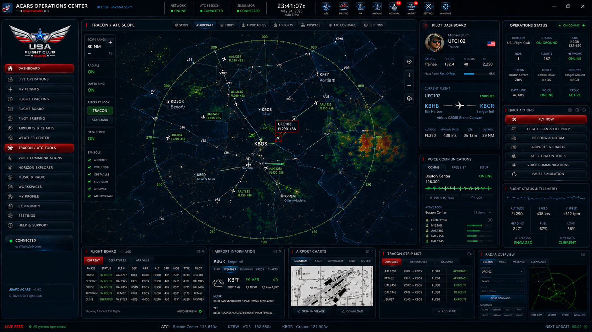
      <br>
      <strong>Expanded TRACON Scope</strong>
    </td>
    <td width="50%" align="center">
      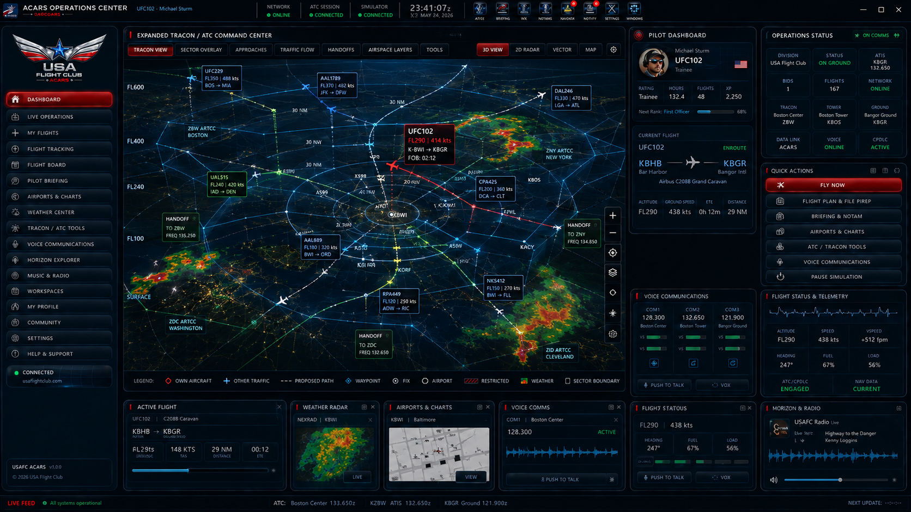
      <br>
      <strong>Layered 3D Airspace</strong>
    </td>
  </tr>
</table>

<p align="center">
  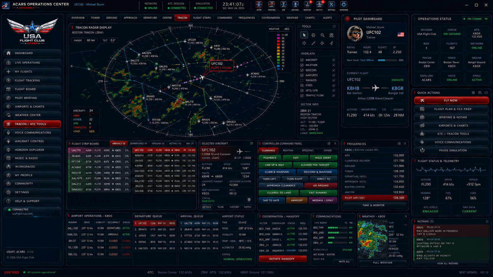
</p>

<p align="center">
  <em>Concept: complete ATC workspace with radar, commands, frequencies, airport operations, weather, and coordination.</em>
</p>

---

## Flight Strips

The ATC flight-strip workspace is intended to synchronize aircraft, controllers, phases, and clearances.

Planned strip groups include:

- Arrivals
- Departures
- Ground
- Active
- Hold
- Bin/Archive

Target strip features include:

- Callsign
- Aircraft type
- Registration
- Route
- Altitude
- Squawk
- Assigned runway
- Departure or arrival time
- Controller remarks
- Clearance state
- Selection synchronization
- Drag-and-drop workflow
- Hold and active queues
- Handoff coordination
- Strip history
- Controller annotations

<p align="center">
  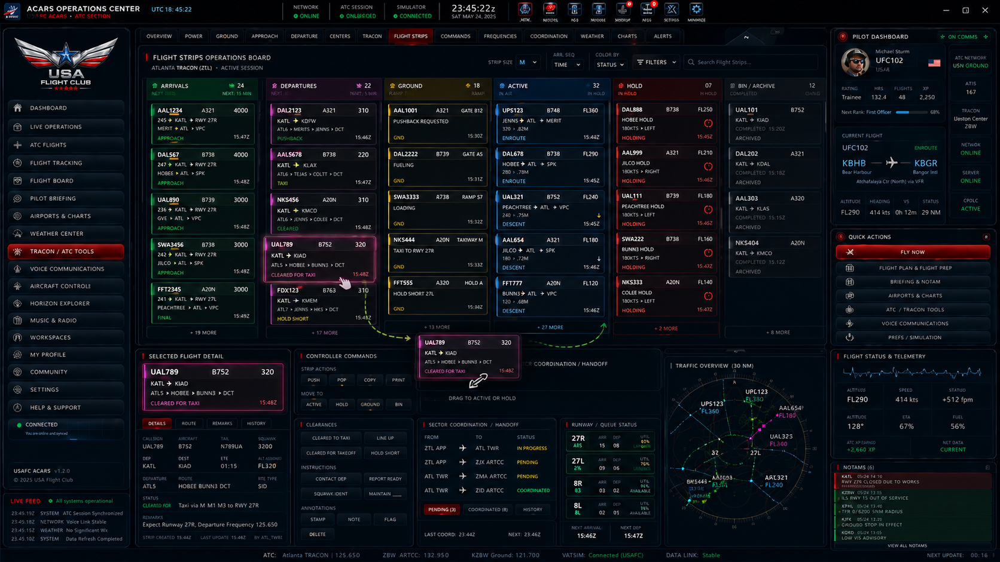
</p>

---

## Airport Selection and Taxi Management

The ATC airport workspace is planned as a complete ground-operations and taxi-management environment.

Target features include:

- Airport selection and favorites
- Live airport status
- Active runways
- Airport diagram
- Gate and ramp layout
- Aircraft labels
- Pushback requests
- Taxi queues
- Taxi-route assignment
- Hold-short commands
- Runway occupancy
- Gate management
- Ramp congestion
- Arrival and departure queues
- Flight strips
- ATIS
- Ground frequencies
- Command log
- Runway-incursion warnings
- Taxi conflicts
- Color-coded clearances
- 3D airport view

<table>
  <tr>
    <td width="50%" align="center">
      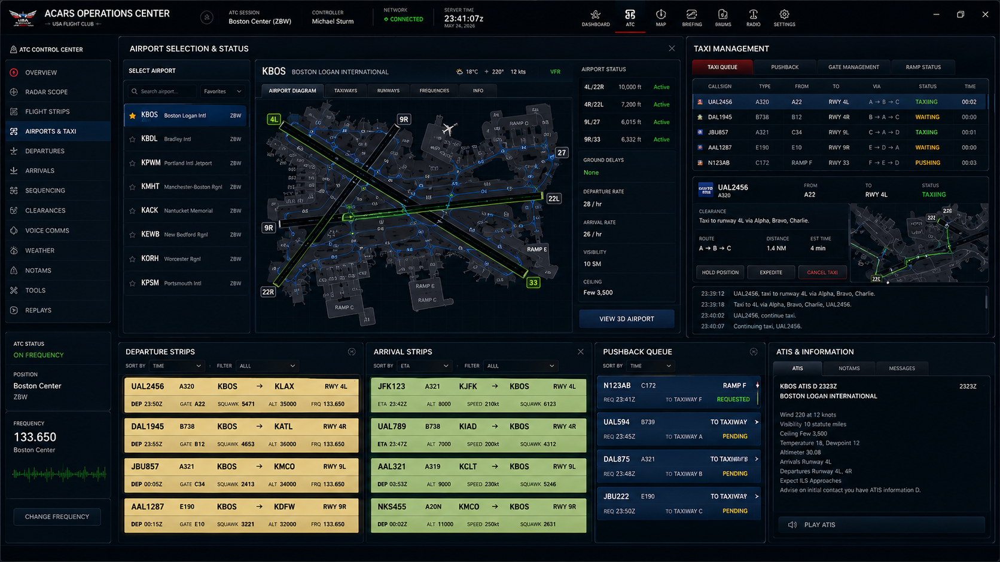
      <br>
      <strong>Airport Selection and Taxi Queues</strong>
    </td>
    <td width="50%" align="center">
      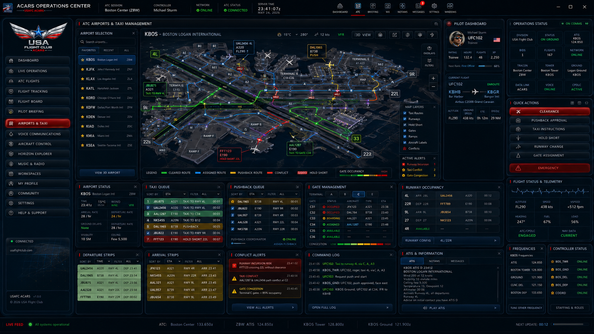
      <br>
      <strong>3D Ground-Operations Command View</strong>
    </td>
  </tr>
</table>

---

# Communications

## Voice Communications

The USAFCACARS Communications Station is an integrated, aircraft-radio-inspired voice workspace connected to the USA Flight Club network and Microsoft Flight Simulator through SimConnect.

Current communications capabilities include:

- Independent COM1 and COM2 selection
- Active and standby frequencies with frequency transfer
- Mouse-operated frequency tuning controls
- Two-way synchronization with simulator COM radios
- Global push-to-talk that remains available while USAFCACARS is not focused
- Live microphone, transmit, and receive level metering
- Selectable microphone and speaker devices
- Microphone and speaker volume controls
- Microphone mute, speaker monitoring, and local audio tests
- Nearby-airport discovery within communications range
- Airport filtering for GA, airfield, airstrip, international, FBO, and open channels
- Published airport frequencies and temporary open channels
- Public and private rooms, including locked-room visibility
- Room creation, joining, disconnecting, rosters, and connection status
- Discord microphone-mute coordination during ACARS push-to-talk when configured

The interface uses a proportional metal radio chassis, illuminated hardware-style controls, digital active/standby readouts, and persistent metal scrollbars for contained lists.

<p align="center">
  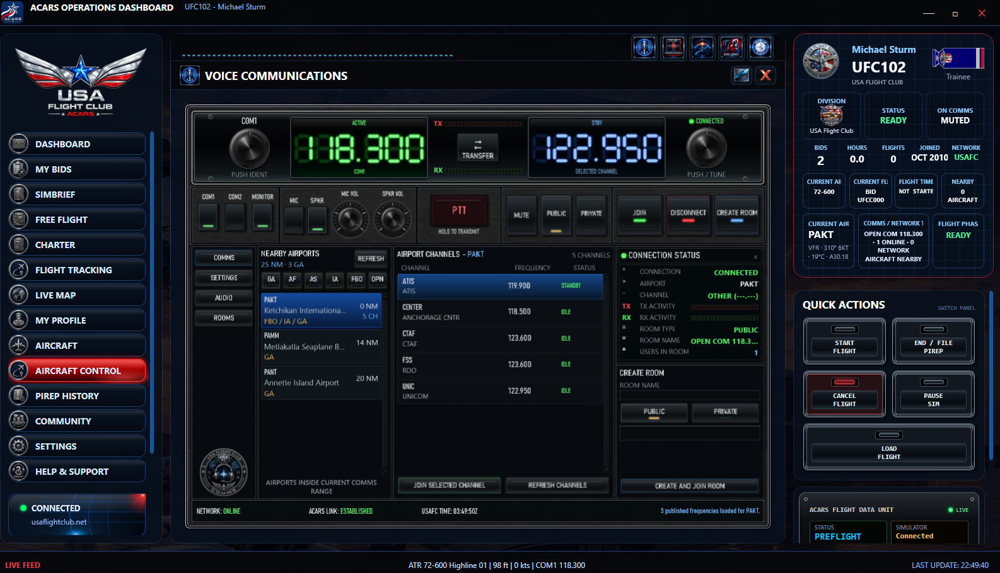
  <br>
  <strong>Current Communications Station</strong>
</p>

<p align="center">
  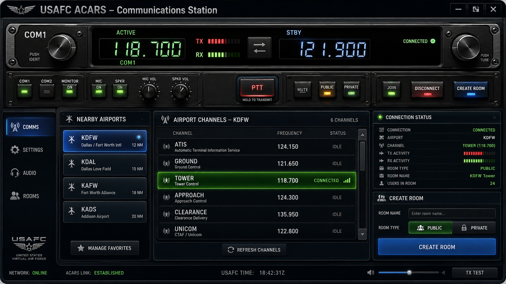
  <br>
  <strong>Communications Station Design Reference</strong>
</p>

### Planned Communications Center

The larger communications-center concept remains part of the project roadmap. It extends the implemented radio with expanded pilot-channel management, connected-aircraft awareness, richer participant controls, automatic room transitions, private messaging, and broader ATC/community communications workflows.

<p align="center">
  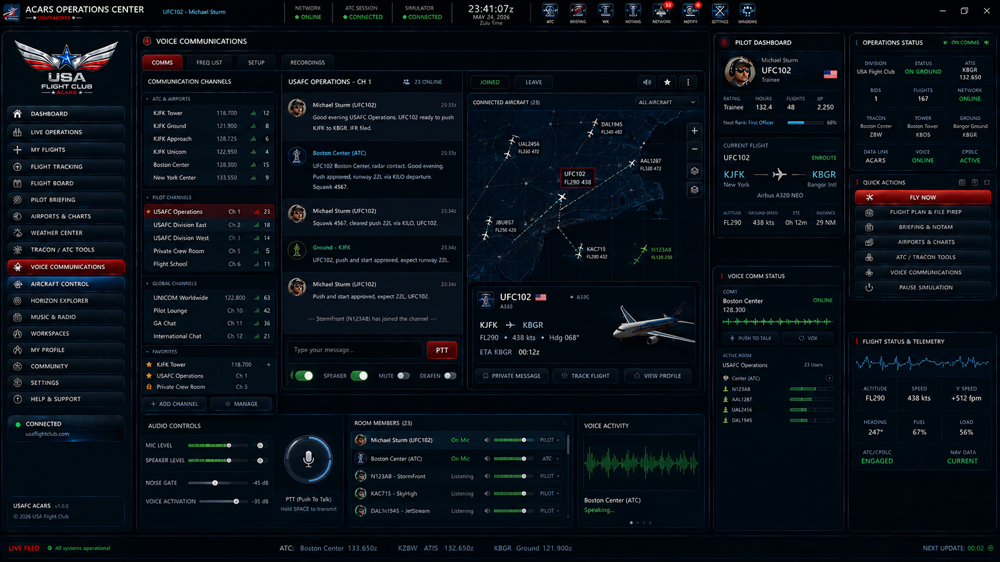
  <br>
  <strong>Planned Expanded Communications Center</strong>
</p>

<table>
  <tr>
    <td width="50%" align="center">
      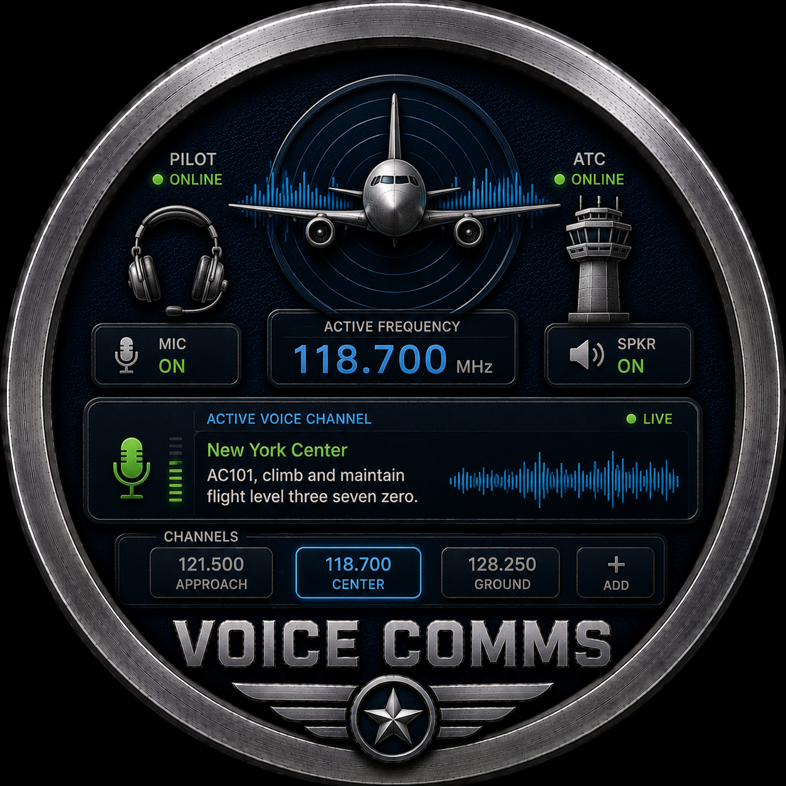
      <br>
      <strong>Planned Voice Communications Visual</strong>
    </td>
    <td width="50%" align="center">
      
      <br>
      <strong>Planned Communications System Visual</strong>
    </td>
  </tr>
</table>

---

# Aircraft and Cabin Systems

## Aircraft Operations and Catalog

The Aircraft workspace now separates the live airframe from the installed-aircraft catalog. The **CURRENT AIRCRAFT** control always returns to the operational view, while **AIRCRAFT CATALOG** opens a cache-first inventory discovered directly from MSFS 2024.

- Installed, streamed, Official, and Community airplanes and helicopters are discovered through aircraft-only live SimConnect catalog enumeration; unrelated ground vehicles, animals, boats, and other SimObjects are excluded.
- Rows are named and searchable by normalized ICAO/model rather than by an external folder mapping. Airbus A330-200 and A330-300 packages are grouped as `A330`; the aerobatic Extra 330 remains the distinct `E330` type.
- Variants and liveries for the same ICAO are consolidated into one full-width aircraft strip. Five responsive strips are shown per page in the expanded workspace; each displays the default and selected paintjob artwork side by side and sends the selected paintjob through the centered **LOAD IN SIM** control.
- A dedicated paintjob selector presents each cached variant independently, closes after selection, and keeps the simulator default unchanged until the pilot explicitly chooses another paintjob.
- The complete inventory remains searchable while a finite, vertically scrollable viewport renders paged, recycled rows. Catalog updates finish all available optimized local thumbnails before reporting completion, and an existing cache silently completes any missing thumbnails in the background. Each visible page and paintjob selector hydrates only from that app-local cache; a bounded in-memory bitmap pool and off-screen image release keep long browsing sessions stable while persistent thumbnails make revisits immediate. Browsing never waits on the API or simulator.
- Twenty-four supplied MSFS 2020 presentation images are physically bundled inside the desktop application and shared once per ICAO. The original source folder is not required at runtime.
- Installed-aircraft changes are detected silently. The update dialog explains whether a refresh is needed, waits for **START**, reports exact-cache progress, and uses bounded background package scans with per-item time limits so protected or streamed packages cannot freeze catalog browsing.
- Exact cached MSFS repaint cards are retained across sessions. The exact simulator `imagePath` remains authoritative, stale artwork-cache generations are refreshed automatically, and a damaged package cannot freeze the catalog. Generic/default ICAO artwork is never substituted for a named livery; an unresolved repaint stays explicitly unavailable until MSFS exposes its exact card.

## Live Cabin and Payload

The Current Aircraft workspace includes an aircraft-aware cabin and payload panel. Built-in airframe profiles provide useful starting layouts, while the cabin editor can define custom seating, facilities, sections, and load zones for aircraft that need a tailored arrangement.

- Switchable cabin layers show seats, facilities, passenger loading, baggage, cargo, and total payload without losing the active-aircraft context.
- Passenger manifests and boarding progress provide an operational view of the live cabin rather than a static concept card.
- Aircraft-specific cabin artwork and a standard cutaway presentation keep unsupported or custom aircraft usable while their detailed profiles are refined.
- Supported payload values can be applied through SimConnect with visible state and failure feedback.

## Aircraft Control

The Aircraft Control workspace is an advanced SimConnect concept intended to display aircraft instruments and expose supported simulator controls.

Aircraft Control carries the same riveted **AIRCRAFT OPERATIONS PANEL** header used by Current Aircraft and the Aircraft Catalog. The active destination is identified by a green illuminated switch, and pilots can move directly among all three aircraft workspaces without returning to the left navigation.

Potential systems include:

- Primary flight instruments
- Engine instruments
- Fuel data
- Electrical systems
- Hydraulics
- Pneumatics
- Pressurization
- Landing gear
- Flaps
- Spoilers
- Trim
- Speed brake
- Parking brake
- Exterior lights
- Cabin lights
- Seatbelt sign
- No-smoking sign
- Batteries and generators
- Avionics master
- External power
- Engine start
- APU
- Anti-ice
- Pitot heat
- Radios
- Transponder
- Doors and services
- Ground power
- Pushback
- Fuel truck
- Chocks
- Alerts and annunciations
- Checklists

The available controls will depend on SimConnect support, simulator behavior, aircraft implementation, and add-on compatibility. Not every aircraft exposes every system in a standardized way.

<p align="center">
  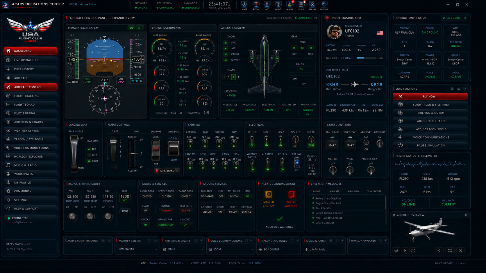
</p>

<p align="center">
  <em>Concept: a complete aircraft instruments and systems control workspace driven by available SimConnect data and events.</em>
</p>

---

## Passenger Operations

Passenger Operations now has a working cabin, manifest, boarding, baggage, cargo, and payload foundation. Deeper service and passenger-experience systems remain under active development as a USAFC-owned implementation.

The concept includes:

- Aircraft cabin configuration
- Seat-map editor
- Class and cabin sections
- Passenger manifest
- Passenger roster
- Seat assignment
- Boarding status
- Baggage and payload
- Comfort and satisfaction
- Passenger needs and special services
- Cabin announcements
- Crew actions
- Meal and beverage service
- Lunch or dinner service
- Movie and entertainment options
- Cabin-service timeline
- Seatbelt sign
- No-smoking sign
- Cabin lighting
- Cabin temperature
- Door controls
- Cargo-door controls
- Stairs and jetway status
- Lavatory status
- Incident reporting
- Passenger surveys
- Arrival and deboarding
- Flight-service scoring

<p align="center">
  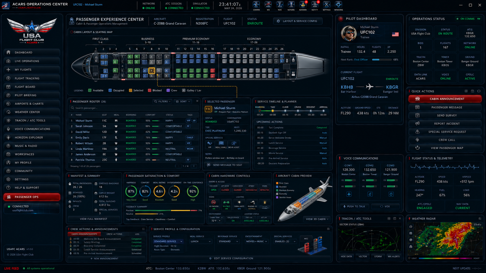
</p>

<p align="center">
  <em>Concept: configurable aircraft seating, passenger roster, cabin services, announcements, hardware controls, and satisfaction tracking.</em>
</p>

---

# Research, Media, and Workspaces

## Horizon Explorer

Horizon Explorer is an integrated multi-tab aviation research browser in the active desktop tree.

Current operational-alpha capabilities include tabs, a USAFC aviation start page, DuckDuckGo search, navigation, WebView2 autofill/password support, pop-outs, draggable tab ownership, persistent bookmark folders, an optional stable-gutter bookmark bar, and Chrome/Edge/HTML import. Ongoing expansion includes:

- Multiple browser tabs
- Pinned sites
- USAFC start page
- Aviation weather resources
- Full-page charts
- Terminal diagrams
- NOTAM workspaces
- Aircraft manuals
- Route plans
- Airport documents
- Search
- Print
- Download
- Draggable browser panels
- Separate windows
- Loading indicators
- Saved resources
- Safe external navigation

<table>
  <tr>
    <td width="50%" align="center">
      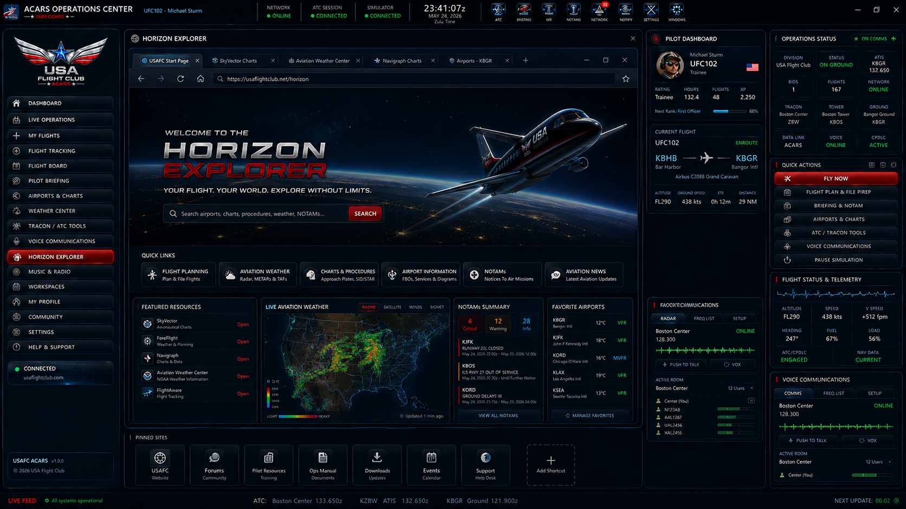
      <br>
      <strong>Horizon Explorer Start Workspace</strong>
    </td>
    <td width="50%" align="center">
      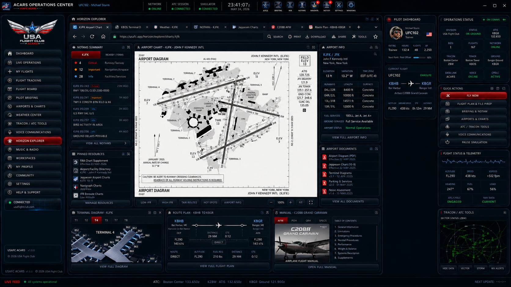
      <br>
      <strong>Aviation Research Studio</strong>
    </td>
  </tr>
</table>

---

## Music and Radio

The Music & Radio Center is intended to provide entertainment and aviation-radio tools without interfering with voice communications.

Target features include:

- Music Player tab
- Radio Scanner tab
- Music Radio Player tab
- Local playlists
- Favorites
- Now-playing queue
- Album artwork
- Playback controls
- Shuffle and repeat
- Equalizer
- Audio visualizer
- Audio-output selection
- Balance and spatial controls
- USAFC Radio
- Aviation radio presets
- Live transmission list
- Squelch
- Record controls where permitted
- Independent volume control
- Quick-access shortcuts

<p align="center">
  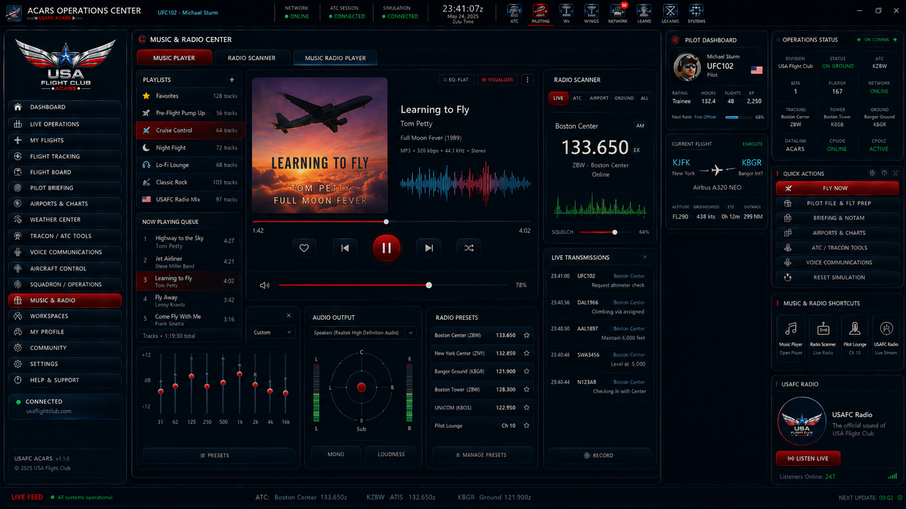
</p>

---

## Workspace Manager

The Workspace Manager turns USAFCACARS into a multi-monitor operations center. Pilots can arrange detached ACARS tools, apply real layout presets, save named profiles with window bounds and states, restore visible tools, recover off-screen windows, and reset invalid configuration safely.

Current operational-alpha capabilities include:

- Grid
- Rows
- Columns
- Stacks
- BSP
- Ultrawide
- Floating windows
- Pop-out panels
- Saved window positions
- Saved window sizes
- Saved monitor assignments
- Fullscreen windows
- Multi-monitor workspaces
- Layout naming and management
- One-click saved-layout loading
- Workspace reset
- Off-screen window recovery
- Layout restoration after restart

<p align="center">
  
</p>

### Saved Multi-Monitor Layouts

A saved workspace is intended to restore much more than a list of open panels. Loading a saved layout should rebuild the pilot's complete operations setup across the monitors that were assigned when the layout was saved.

A saved layout may restore:

- Which USAFCACARS tools are open
- Which monitor each tool belongs on
- Window position and size
- Maximized or fullscreen state
- Docked, tiled, stacked, or floating placement
- Pop-out state
- Map and operational panel placement
- Flightboard placement
- ATC/TRACON placement
- Briefing and chart placement
- Voice Communications placement
- Aircraft Control placement
- Weather and map placement
- Telemetry and system-monitor placement
- Community and support panels where selected

The concept below demonstrates two examples of the same Workspace system after a pilot chooses a saved layout: a **three-monitor flight-operations layout** and a **five-monitor command-center layout**.

<p align="center">
  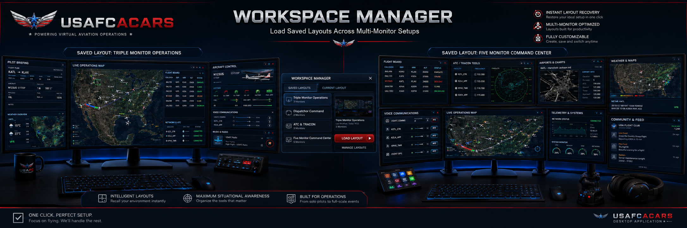
  <br>
  <strong>Saved Layouts — Three-Monitor Operations and Five-Monitor Command Center</strong>
</p>

#### Three-Monitor Operations

A three-monitor saved layout can divide the cockpit desktop into dedicated operating zones. For example:

- **Monitor 1:** Pilot Briefing, weather summary, flight information, or charts
- **Monitor 2:** Live Operations Map and Flightboard
- **Monitor 3:** Aircraft Control, Voice Communications, network/ATC status, and Music & Radio

The exact arrangement is controlled by the pilot and saved as part of the layout.

#### Five-Monitor Command Center

A five-monitor saved layout can expand USAFCACARS into a broader command-center environment. A layout may dedicate displays to combinations such as:

- Flightboard and active-flight information
- ATC/TRACON tools
- Airports and Charts
- Live Operations Map
- Voice Communications
- Weather and map layers
- Telemetry and aircraft systems
- Community activity
- Aircraft Control
- Pilot Briefing or Horizon Explorer

The purpose is not to force a fixed five-screen arrangement. The five-monitor concept demonstrates how the same Workspace Manager can restore a much larger personalized operating environment when additional displays are available.

#### Loading a Saved Layout

The intended workflow is:

1. Open **Workspace Manager**.
2. Select **Saved Layouts**.
3. Choose a named layout such as `Triple Monitor Operations` or `Five Monitor Command Center`.
4. Select **Load Layout**.
5. USAFCACARS restores the saved panels, windows, monitor assignments, positions, sizes, and supported workspace states.
6. The pilot can continue working immediately or make changes and save the arrangement again.

If a previously assigned monitor is unavailable, Workspace Manager is intended to recover those windows onto an available display rather than leave them inaccessible off-screen.

> [!NOTE]
> The multi-monitor image is a **concept visualization** of the intended saved-layout experience. Exact panels, monitor assignments, window geometry, and restoration behavior may change as Workspace Manager development continues.

---

# Pilot, Community, and Support

## Pilot Profile

The Pilot Profile is planned as a career command center and USAFC personnel record.

Current dashboard information includes:

- Pilot avatar
- Pilot ID and callsign
- Division
- Rank
- Rank progression
- Level and experience
- Total flight time
- Flights and landings
- Distance flown
- Recent flights
- Route history
- Monthly activity
- Aircraft time breakdown
- Ratings
- Endorsements
- Certifications
- Type qualifications
- Achievements
- Badges
- Career milestones
- Logbook
- Personal account information
- Connected services

<table>
  <tr>
    <td width="50%" align="center">
      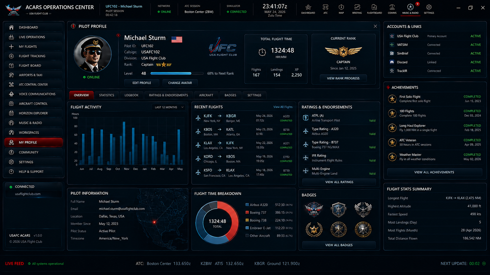
      <br>
      <strong>Pilot Profile and Statistics</strong>
    </td>
    <td width="50%" align="center">
      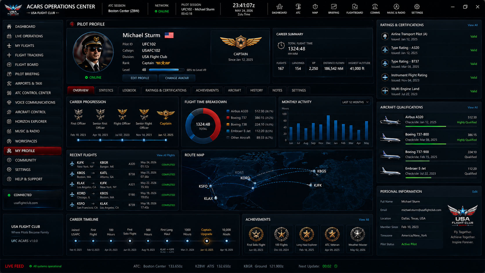
      <br>
      <strong>Career Progression and Achievements</strong>
    </td>
  </tr>
</table>

---

## Pilot Social

Pilot Social is now the shared community and notification layer for the phpVMS website and USAFCACARS desktop application. Both clients use the same private USAFCSocial backend, so posts, buddy activity, private transmissions, notifications, birthdays, flight milestones, and Paper Airplane results remain synchronized without a separate desktop database.

Implemented Pilot Social capabilities include:

- A live network feed with pilot identity, avatar, rank, media/link presentation, comments, editing, deletion, sharing, and silent updates that preserve the pilot's scroll and composer state
- Contextual pilot records with the selected pilot's real assigned division/logo, country flag, home and current location, permission-aware network role, linked operations totals, and a profile-only join-date service display with gold completed-year stars plus a silver current-year star
- Scheduled Twitch broadcasts with a server-synchronized countdown, animated aviation broadcast background, automatic in-place player transition, persistent Watch Live access, and correct live/VOD/clip players
- Responsive, contained playback for public Facebook single-video, reel, and split multi-video post embeds, YouTube videos/live links, Twitch, Vimeo, Dailymotion, TikTok, Instagram, Streamable, Rumble, Loom, Kick, and web-native direct video files, with safe rich cards for sites that disallow framing
- Independent scrolling feed and discovery columns with remembered collapsed pilot panels
- Notification badges, category filters, read/unread state, mark-all-read, dismiss, and contextual actions
- Administrator-controlled category availability combined with clear per-pilot notification preferences
- Optional birthday month/day, separately controlled year visibility, reminders, profile actions, and private birthday transmissions
- A locally bundled, searchable 1,697-entry emoji library behind compact smiley dropdowns for posts, comments, private transmissions, and reactions
- Like, Love, Laugh, Celebrate, and Wow reactions
- Meaningful automated aviation/community cards through a shared internal event-publisher interface
- Server-authoritative **Toss Paper Airplane** buddy interactions, return tosses, randomized outcome text, cooldown enforcement, current-period and all-time leaderboards, and lifetime scoring that survives detailed-history cleanup

The Paper Airplane client submits only the requested action. Eligibility, cooldown, outcome, message, and both pilots' scores are determined and stored by the server.

> [!IMPORTANT]
> The proprietary USAFCSocial module and API remain in the private site repository and are intentionally excluded from this public Releases repository.

<p align="center">
  
</p>

---

## Community Hub

The Community Hub is intended to connect pilots directly from the desktop application and extend that community experience to other participating virtual airlines.

Planned areas include:

- Community feed
- Groups
- Events
- Gallery
- Discord integration
- Leaderboards
- Membership
- Online members
- Live pilot status
- Community chat
- Group flights
- Event RSVP
- Recent activity
- Achievements
- Screenshot sharing
- USAFC announcements
- Virtual Airline Online Presence directory
- Participating-airline statistics and activity
- Cross-airline pilot directory and pilot search
- Buddy-list management
- Buddy online and flight-status alerts

<p align="center">
  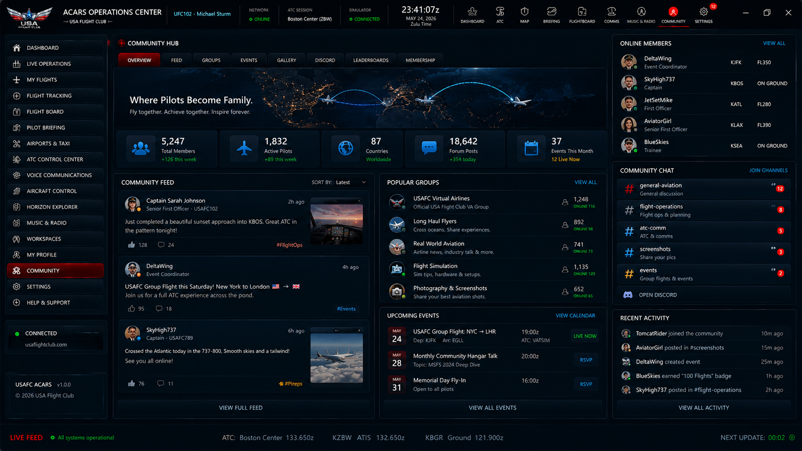
</p>

### Virtual Airline Online Presence

The Community section is also planned to provide a shared virtual-airline discovery system through the USAFCACARS module.

A virtual airline will appear in the USAFCACARS airline directory only when that airline has **Online Presence** enabled by an administrator in its USAFCACARS module settings. This gives each participating airline control over whether its organization and eligible pilot activity are visible to the wider USAFCACARS community.

The airline directory is intended to provide:

- A searchable list of virtual airlines with Online Presence enabled
- Airline logo, name, code, and online-status information
- Number of pilots currently online
- Total registered members
- Active-flight count
- Primary hub or operating region
- Community-wide online-airline and pilot totals
- Filtering and sorting
- Direct access to each participating airline's community profile
- Quick access to pilot browsing and buddy lists

<p align="center">
  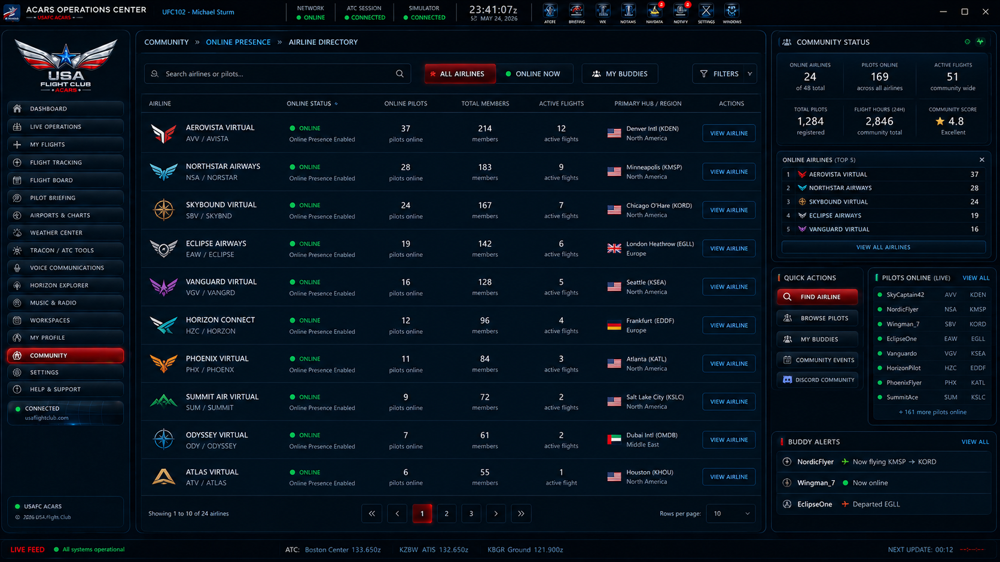
  <br>
  <strong>Online Presence — Participating Virtual Airline Directory</strong>
</p>

### Airline Profile and Member Directory

Selecting a participating virtual airline opens a detailed airline community profile.

The airline view is planned to include:

- Airline identity, logo, code, description, and website
- Online Presence status
- Total members
- Pilots currently online
- Active flights
- Total flight hours
- Fleet size
- Hub information
- Airline performance and activity statistics
- Top hubs
- Most-active pilots
- Recent airline activity
- Searchable member roster
- Pilot search by name, callsign, or pilot ID
- Pilot rank
- Home airport
- Online, offline, on-ground, and enroute status
- Total pilot hours
- Last-flight information
- Pilot preview cards
- Mutual-buddy information
- Current-flight information when available
- **Add Buddy** and buddy-status controls
- Direct pilot-profile access

The buddy system is intended to work across participating airlines so pilots can find other USAFCACARS users, add them to a personal buddy list, and see permitted online or flight-status updates without requiring membership in the same virtual airline.

<p align="center">
  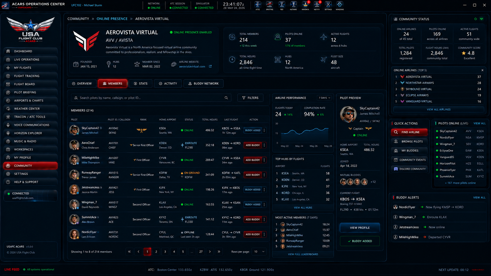
  <br>
  <strong>Airline Profile — Statistics, Members, Pilot Search, and Buddy Network</strong>
</p>

> [!NOTE]
> Online Presence is intended to be opt-in at the virtual-airline administration level. Exact pilot fields, public visibility, buddy visibility, and live-status information should follow the permissions and privacy controls configured by the participating airline and USAFCACARS service.

---

## Help and Support

The Help & Support Center is implemented as a searchable in-app operating guide and diagnostics workspace with contextual HD illustrations, connection checks, sanitized support diagnostics, documentation links, and integrated bug-report preparation.

Current and planned capabilities include:

- Help search
- Getting-started guides
- Knowledge base
- Video tutorials
- Downloads
- System status
- Support tickets
- Contact support
- Troubleshooting guides
- Connection tests
- System diagnostics
- Log viewer
- Settings reset
- Add-on and plugin management
- Popular topics
- Current ticket status
- Useful resources

<p align="center">
  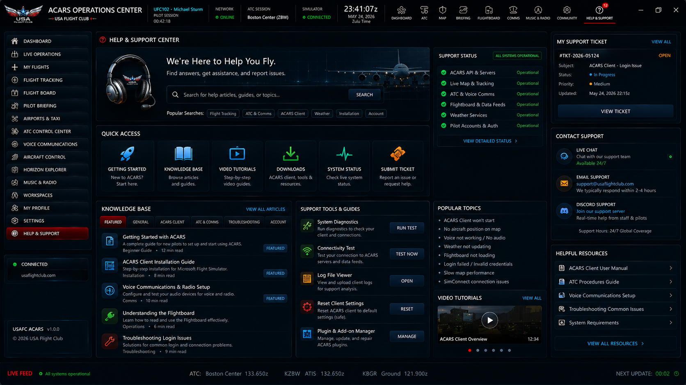
</p>

---

# Simulator and Server Integration

## SimConnect

USAFCACARS is intended to receive simulator telemetry and, where supported, send commands through SimConnect.

Potential telemetry includes:

- Latitude and longitude
- Altitude
- Ground speed
- Indicated and true airspeed
- Heading
- Vertical speed
- On-ground state
- Gear position
- Flaps
- Spoilers
- Fuel
- Engine data
- Electrical state
- Lights
- Doors
- Parking brake
- Transponder
- Radio frequencies
- Autopilot data
- Aircraft identity
- Landing rate
- Simulator state

Actual availability varies by aircraft and simulator. Complex third-party aircraft may use custom variables, events, WASM bridges, local variables, or proprietary interfaces that require aircraft-specific adapters.

## USAFC API Integration

The desktop application is intended to communicate with the proprietary USAFCACARS phpVMS module for:

- Server ping
- Authentication
- Pilot profile
- Bid retrieval
- Flight start
- Telemetry updates
- Flight completion
- Flight cancellation
- Live-flight data
- Weather services
- Airport information
- Chart information
- Communications authorization
- Room and frequency information
- Application configuration
- Version and update checks

Passwords and full authentication tokens must never be written to normal application logs.

---

# Flight Phases

USAFCACARS is intended to follow the aircraft through a complete flight lifecycle using the standard USAFCACARS phase color system.

> [!IMPORTANT]
> **Flight Phase and Flight Status are separate values.**  
> The colors below represent the **phase** only. Flightboard status colors are handled independently so a pilot can have a phase such as **CRUISE** while the operational status remains **EN ROUTE**.

> [!NOTE]
> GitHub README rendering does not always preserve custom CSS color styling consistently, so the chart below uses **actual color swatch emojis** plus the locked **hex color values** to clearly showcase the standard USAFCACARS phase colors.

<table>
  <thead>
    <tr>
      <th align="left">Flight Phase</th>
      <th align="left">Color Showcase</th>
      <th align="left">Standard Color</th>
      <th align="left">Color Code</th>
    </tr>
  </thead>
  <tbody>
    <tr>
      <td><strong>PREFLIGHT</strong></td>
      <td>⚪ ⚪ ⚪</td>
      <td><strong>Silver / White</strong></td>
      <td><code>#FFFFFF</code></td>
    </tr>
    <tr>
      <td><strong>BOARDING</strong></td>
      <td>🟢 🟢 🟢</td>
      <td><strong>Green</strong></td>
      <td><code>#00FF66</code></td>
    </tr>
    <tr>
      <td><strong>PUSHBACK</strong></td>
      <td>🟡 🟡 🟡</td>
      <td><strong>Yellow / Gold</strong></td>
      <td><code>#FFD400</code></td>
    </tr>
    <tr>
      <td><strong>TAXI OUT</strong></td>
      <td>🟡 🟡 🟡</td>
      <td><strong>Yellow / Gold</strong></td>
      <td><code>#FFD400</code></td>
    </tr>
    <tr>
      <td><strong>TAKEOFF</strong></td>
      <td>🟠 🟠 🟠</td>
      <td><strong>Orange</strong></td>
      <td><code>#FF9900</code></td>
    </tr>
    <tr>
      <td><strong>INITIAL CLIMB</strong></td>
      <td>🟠 🟠 🟠</td>
      <td><strong>Orange</strong></td>
      <td><code>#FF9900</code></td>
    </tr>
    <tr>
      <td><strong>CLIMB</strong></td>
      <td>🟠 🟠 🟠</td>
      <td><strong>Orange</strong></td>
      <td><code>#FF9900</code></td>
    </tr>
    <tr>
      <td><strong>CRUISE</strong></td>
      <td>🟢 🟢 🟢</td>
      <td><strong>Green</strong></td>
      <td><code>#00FF66</code></td>
    </tr>
    <tr>
      <td><strong>DESCENT</strong></td>
      <td>🔵 🔵 🔵</td>
      <td><strong>Cyan / Sky Blue</strong></td>
      <td><code>#00CCFF</code></td>
    </tr>
    <tr>
      <td><strong>APPROACH</strong></td>
      <td>🔵 🔵 🔵</td>
      <td><strong>Cyan / Sky Blue</strong></td>
      <td><code>#00CCFF</code></td>
    </tr>
    <tr>
      <td><strong>LANDING</strong></td>
      <td>🔴 🟠 🔴</td>
      <td><strong>Red-Orange</strong></td>
      <td><code>#FF5B2E</code></td>
    </tr>
    <tr>
      <td><strong>TAXI IN</strong></td>
      <td>🟡 🟡 🟡</td>
      <td><strong>Yellow / Gold</strong></td>
      <td><code>#FFD400</code></td>
    </tr>
    <tr>
      <td><strong>AT GATE</strong></td>
      <td>⚪ ⚪ ⚪</td>
      <td><strong>Silver / White</strong></td>
      <td><code>#FFFFFF</code></td>
    </tr>
    <tr>
      <td><strong>SHUTDOWN</strong></td>
      <td>⚪ ⚪ ⚪</td>
      <td><strong>Silver / White</strong></td>
      <td><code>#FFFFFF</code></td>
    </tr>
    <tr>
      <td><strong>COMPLETED</strong></td>
      <td>⚪ ⚪ ⚪</td>
      <td><strong>Silver / White</strong></td>
      <td><code>#FFFFFF</code></td>
    </tr>
  </tbody>
</table>

### Phase Color Groups

The phase-color engine also treats the following equivalent operational labels as part of the same standard groups:

| Color Showcase | Standard Color | Phase aliases |
|---|---|---|
| 🟢 🟢 🟢 | **Green** `#00FF66` | `BOARDING`, `READY`, `LOADING`, `CRUISE`, `LEVEL`, `ENROUTE` |
| 🟡 🟡 🟡 | **Yellow / Gold** `#FFD400` | `TAXI`, `TAXIOUT`, `TAXIIN`, `PUSHBACK` |
| 🟠 🟠 🟠 | **Orange** `#FF9900` | `TAKEOFF`, `INITIAL CLIMB`, `CLIMB` |
| 🔵 🔵 🔵 | **Cyan / Sky Blue** `#00CCFF` | `DESCENT`, `APPROACH` |
| 🔴 🟠 🔴 | **Red-Orange** `#FF5B2E` | `LANDING`, `LANDED` |
| ⚪ ⚪ ⚪ | **Silver / White** `#FFFFFF` | `PREFLIGHT`, `AT GATE`, `SHUTDOWN`, `COMPLETED`, neutral lifecycle phases |

The phase engine is intended to use stabilization logic so that normal simulator noise, brief runway contact, small altitude fluctuations, or short-lived state changes do not cause rapid phase oscillation.

---

# System Requirements

Exact requirements are provided with each release.

General target requirements:

| Requirement | Details |
|---|---|
| Operating system | Windows 10 or Windows 11 |
| Architecture | 64-bit Windows |
| Simulator | Microsoft Flight Simulator 2020 and/or Microsoft Flight Simulator 2024 |
| USAFC account | Active USA Flight Club pilot account for connected services |
| Internet | Required for login, server synchronization, live operations, and online services |
| SimConnect | Required for simulator telemetry and supported aircraft commands |
| WebView2 | Required by builds using Microsoft Edge WebView2 |
| Audio devices | Required for voice communications, microphone testing, and audio playback |
| Runtime | Listed in the release notes or included with the installer |

Not all features require the simulator to be running, but flight tracking and aircraft control do.

---

# Installation

1. Open the [latest release](../../releases/latest).
2. Read the release notes and known limitations.
3. Download the correct installer or portable package.
4. Verify the SHA-256 checksum when provided.
5. Close any running copy of USAFCACARS.
6. Install or extract the application.
7. Start USAFCACARS.
8. Sign in with a valid USA Flight Club pilot account.
9. Review API, simulator, audio, and workspace settings.
10. Start Microsoft Flight Simulator when simulator features are needed.

Do not install an update over a running copy of the application.

---

# Alpha Testing

Alpha testers should expect:

- Frequent updates
- Incomplete modules
- Disabled buttons
- Placeholder data
- Database or configuration changes
- UI revisions
- Missing aircraft-specific integrations
- Temporary diagnostic controls
- Occasional crashes or connection failures

Before reporting a defect:

1. Confirm the installed version.
2. Read the release notes.
3. Reproduce the problem.
4. Record the exact steps.
5. Note whether MSFS 2020 or MSFS 2024 was running.
6. Note the aircraft and add-on version.
7. Include relevant log excerpts.
8. Remove passwords, tokens, personal information, and private communications.

Open a report through the repository issue tracker when enabled:

[Create a USAFCACARS issue](../../issues/new/choose)

---

# Release Channels

| Channel | Purpose |
|---|---|
| **Alpha** | Active development and internal/controlled testing |
| **Beta** | Broader testing after major systems become stable |
| **Stable** | Recommended production release after validation |
| **Development** | Experimental build that may be incomplete or unstable |
| **Legacy** | Previous release retained for compatibility or rollback |

During the current development phase, most public or tester builds should be treated as **Alpha** unless the release explicitly states otherwise.

---

# Checksums

Official release files may include SHA-256 checksums.

PowerShell example:

```powershell
Get-FileHash .\USAFCACARS-Setup.exe -Algorithm SHA256
```

Compare the returned value with the checksum published in the release notes. Do not install a package when the checksum does not match.

---

# Troubleshooting

## Application does not start

- Confirm the supported Windows version.
- Install the runtime listed in the release notes.
- Install Microsoft Edge WebView2 Runtime when required.
- Restart Windows after prerequisite installation.
- Review the application log and known issues.

## Simulator does not connect

- Confirm Microsoft Flight Simulator is running.
- Load fully into an aircraft before retrying.
- Confirm the application is using the correct simulator adapter.
- Close stale USAFCACARS processes.
- Confirm SimConnect dependencies are installed.
- Restart USAFCACARS after the simulator has loaded.

## Login fails

- Confirm the USA Flight Club website is reachable.
- Verify the pilot credentials.
- Distinguish invalid credentials from a server-connection error.
- Confirm the application is configured for the correct API environment.
- Check whether the installed alpha build requires an update.

## ACARS update is interrupted during flight

- Flight tracking continues through transient API delays and retries the same idempotent update instead of creating duplicate positions.
- Cruise and other phase transitions allow additional acknowledgement time, and an optional automated-ATC advisory cannot invalidate telemetry that the server already stored.
- Read the detailed reason shown in the tracking status. If failures repeat, confirm the USA Flight Club site is reachable and that the current USAFCACARS server module is deployed.
- Keep the application running while troubleshooting so locally collected flight data is not needlessly interrupted.

## Voice or audio does not work

- Confirm the selected microphone and speaker devices.
- Check Windows microphone permissions.
- Run the microphone playback and speaker tests.
- Confirm another program is not exclusively locking the device.
- Reopen Voice & Radio Settings after reconnecting hardware.

## Map or Horizon Explorer is blank

- Confirm internet access.
- Install or repair Microsoft Edge WebView2 Runtime.
- Check firewall and security software.
- Reload the panel or restart the application.
- Review logs for blocked content or initialization failures.

---

# Security and Privacy

USAFCACARS may process account, pilot, flight, simulator, map, communications, and diagnostic data required for operation.

Never publish or commit:

- Passwords
- Authentication tokens
- API secrets
- Database credentials
- Private certificates
- Private communications
- Unredacted diagnostic logs containing sensitive data
- Development bypass credentials
- Administrator credentials

Security concerns should be reported privately to USA Flight Club administration.

---

# Repository Purpose

This repository is intended to distribute official USAFCACARS desktop releases and public documentation.

It may contain:

- Installers
- Portable packages
- Release notes
- Checksums
- Public documentation
- Concept artwork
- Application screenshots
- Compatibility information
- Installation instructions

This release repository does **not** make the USAFCACARS source code open source.

---

# Concept Image Index

All images below are stored under:

```text
assets/readme/
```

| File | Purpose |
|---|---|
| `usafc-logo.png` | USA Flight Club branding |
| `usafcacars-hero.png` | README hero |
| `dashboard.png` | Dashboard visual |
| `workspace-manager.png` | Workspace feature visual |
| `workspace-manager1.png` | Saved Workspace layouts across three-monitor and five-monitor setups |
| `usafc_acars.png` | Complete application concept |
| `operations-center.png` | Operations-center overview |
| `left_nav_panel.png` | Fixed lower-left connection, airport/weather, and version card design |
| `usafc_right_panel.png` | Responsive right operations rail design |
| `live-map.png` | Live-map visual |
| `usafc_map.png` | Expanded live map |
| `flightboard.png` | Flightboard visual |
| `usafc_flightboard.png` | Expanded flightboard |
| `voice-communications.png` | Voice communications visual |
| `comms.png` | Communications visual |
| `usafc_comms.png` | Expanded communications center concept |
| `usafc_comms2.png` | Communications Station design reference |
| `usafc_comms_actual.png` | Current Communications Station implementation |
| `usafc_tracon.png` | TRACON radar |
| `usafc_tracon2.png` | Futuristic layered TRACON |
| `usafc_tracon_atc.png` | Complete ATC section |
| `usafc_atc_flightstrips.png` | ATC flight strips |
| `usafc_atc_taxitrafic.png` | Airport and taxi management |
| `usafc_atc_taxitrafic2.png` | 3D ground operations |
| `usafc_horizon.png` | Horizon Explorer |
| `usafc_horizon2.png` | Aviation research studio |
| `usafc_briefing.png` | Pilot briefing |
| `usafc_aircraftcontrol.png` | Aircraft control panel |
| `usafc_musicradio.png` | Music and radio center |
| `usafc_pilot.png` | Pilot profile |
| `usafc_pilot_animated.png` | Pilot career concept |
| `usafc_community.png` | Community Hub |
| `usafc_community1.png` | Community Online Presence virtual airline directory |
| `usafc_community2.png` | Virtual airline profile, member directory, pilot search, and buddy network |
| `usafc_support.png` | Help and Support |
| `usafc_passengerops.png` | Passenger Operations |

---

# Proprietary Software

USAFCACARS is proprietary software developed for USA Flight Club.

Unless expressly authorized in writing, users may not:

- Redistribute the application
- Rebrand the application
- Resell the application
- Publish private source code
- Remove ownership notices
- Extract proprietary USAFC assets
- Use USAFCACARS for an unrelated organization
- Reverse engineer or modify the application except where applicable law expressly permits otherwise

Third-party components remain subject to their respective licenses.

```text
Copyright © 2026 USA Flight Club.
All rights reserved.
```

---

## Official Links

- **USA Flight Club:** [https://usaflightclub.net](https://usaflightclub.net)
- **USAFCACARS Live Map:** [https://usaflightclub.net/usafcacars/live](https://usaflightclub.net/usafcacars/live)
- **Official Downloads:** [https://usaflightclub.net/downloads](https://usaflightclub.net/downloads)
- **Latest GitHub Release:** [View release](../../releases/latest)
- **Issue Tracker:** [View issues](../../issues)

---

<p align="center">
  
</p>

<p align="center">
  <strong>USA Flight Club</strong><br>
  Where pilots become family.
</p>

<p align="center">
  <sub>USAFCACARS is proprietary software in active alpha development. All interface concepts are subject to change.</sub>
</p>
